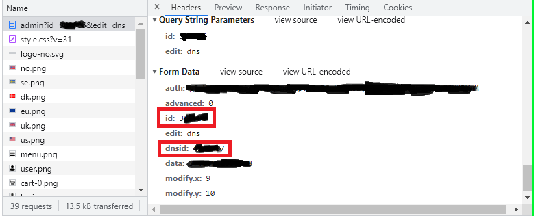

## DYNDNS-Domeneshop

This is a super simple python script to automatically update the DNS record of a subdomain to reflect the current public IP address of the machine running the script. It's meant to be run with CRON or any other scheduling tool. There are five config variables that needs to be updated:

```
API_TOKEN="TOKEN"
API_SECRET="SECRET"

DOMAIN_ID=000000
RECORD_ID=0000000
HOST="subdomain"
```

The token and secret can be found by creating an API key here: [https://www.domeneshop.no/admin?view=api](https://www.domeneshop.no/admin?view=api).

The domain ID and record ID are a bit tricky to find. The simplest way I've found is to open the inspector in your browser (Shift+Ctrl+I in chromium-based browsers), switch to the Network tab, and then look for the server request when manually updating the subdomain entry in the domeneshop admin interface. 



## Installing
As with all python projects, you should create a virtual environment where the requirements can be installed. 

```
cd 
git clone https://github.com/blixhavn/dyndns-domeneshop.git
cd dyndns-domeneshop
python3 -m venv venv
source venv/bin/activate
pip install -r requirements.txt
```

then you can add it to CRON by writing `crontab -e` and adding a line:
```
*/30 * * * * /home/<user>/dyndns-domeneshop/venv/bin/python /home/<user>/dyndns-domeneshop/dyndns.py 